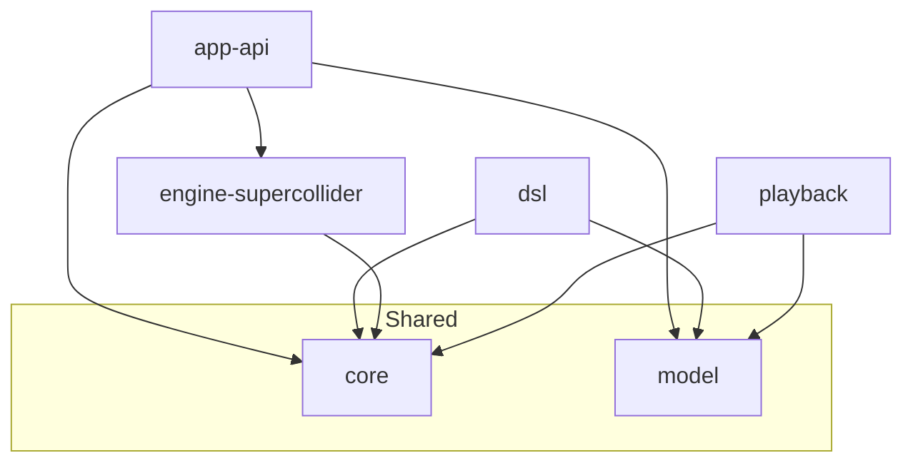

# Module Linkage

This document defines the inter-module dependency graph for the `riddim` project.

## Dependency Graph

## Module Responsibilities & Boundaries

| Module                 | Responsibility                   | Inbound Dependencies         | Outbound Dependencies                   |
|------------------------|----------------------------------|------------------------------|-----------------------------------------|
| `core`                 | Interfaces and base types        | All modules                  | None                                    |
| `model`                | Domain data types (Timing, etc.) | `app-api`, `dsl`, `playback` | None                                    |
| `engine-supercollider` | SuperCollider OSC implementation | `app-api`                    | `core`                                  |
| `playback`             | Event scheduling and timing      | None (Planned for `app-api`) | `core`, `model`                         |
| `dsl`                  | Kotlin composition DSL           | None                         | `core`, `model`                         |
| `app-api`              | Quarkus REST entry point         | None (External users)        | `core`, `model`, `engine-supercollider` |

## Enforcement

- Dependencies are defined in `modules/*/build.gradle.kts`.
- Circular dependencies are strictly prohibited.
- Implementation details of `engine-supercollider` should be hidden behind `core` interfaces.
